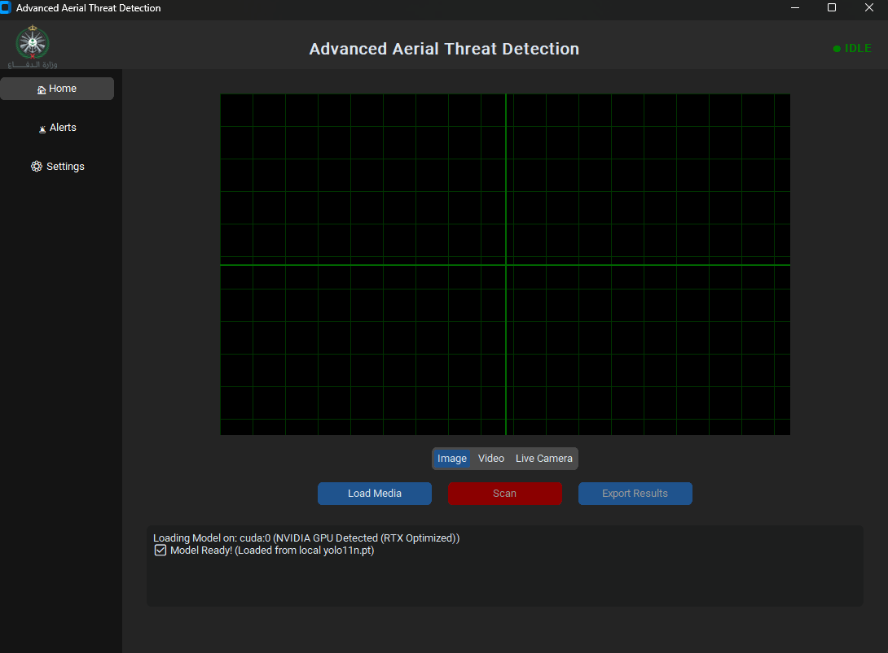

# Advanced Aerial Threat Detection System (AATD)

An advanced, real-time computer vision application designed to identify and track aerial threats, including drones, missiles, and unauthorized aircraft. Built with Python, PyTorch, and YOLO (You Only Look Once) architecture, AATD processes media feeds to deliver critical, instantaneous alerts.

## 🌟 Key Features (المزايا)

* **Real-Time AI Inference**: Utilizes highly optimized YOLO architecture running on PyTorch for lightning-fast object detection, scaling dynamically with GPU (CUDA) acceleration when available.
* **Multi-Source Inputs**: Seamlessly supports live camera feeds (webcams/security cameras), static image analysis, and pre-recorded video processing.
* **Intelligent False-Positive Filtering**: Implements a robust "Ignore List" system to automatically filter out benign objects (like birds, commercial airplanes, or clouds), reducing alert fatigue and focusing only on true threats.
* **Automated Threat Logging & Media Export**: Every detected threat is logged with timestamp, coordinate estimations, and confidence scores. Instantly exports detailed text reports, threat frame images, and fully processed videos with bounding boxes baked in.
* **Standalone Deployment**: Fully containerized and packaged as an independent executable. It runs completely offline without requiring python dependencies on the target machine.
* **Modern, Tactical UI**: Built with `customtkinter` for a dark, military-grade interface that prioritizes speed, readability, and critical action buttons.

---

## 🖥️ User Interface (واجهة المستخدم)

### 🏠 Home Page
*(The main dashboard where operators can select the media source, initialize the AI model, and monitor the live detection feed.)*

---

### 🚨 Alerts & Reports
*(A comprehensive, searchable log of all detected threats. Operators can click on any entry to review the captured image, export the processed video, or generate a detailed incident report.)*

---

### ⚙️ Settings & Configuration
*(The control panel for fine-tuning the AI's behavior. Users can adjust the minimum confidence threshold, add or remove items from the Threat and Ignore lists, and customize the interface theme.)*

